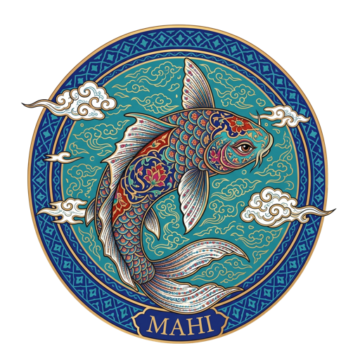

<p align="center">
  
</p>

<h1 align="center">MAHI 🐟</h1>

<p align="center">
  <b>A native agentic IDE for macOS — provider-agnostic, multimodal, extensible, and inspired by Persian art.</b><br/>
  <a href="#فارسی">فارسی</a> · English
</p>

---

MAHI is a native macOS desktop IDE built with Tauri, React, and Rust. It combines a real coding workspace with an autonomous agent, configurable AI providers, MCP integrations, reusable Skills, media generation, safe browser automation, and window-level visual verification.

## What is new

### Provider hub and protocol adapters

- A compact service menu for Sakana, Z.AI, OpenAI, Gemini, MiniMax, DeepSeek, Qwen, OpenRouter, Groq, NVIDIA NIM, local models, MCP, and custom providers.
- Native protocol adapters for OpenAI-compatible Chat Completions, OpenAI Responses, Gemini chat, and fully custom JSON APIs.
- The OpenAI Responses adapter supports streaming, stateless tool-loop replay, encrypted reasoning items, and background polling for long-running models.
- Gemini tool calls preserve thought signatures and support reliable multi-step and parallel tool loops.
- Per-provider and per-model reasoning controls send only values supported by the selected protocol and model.
- A Custom JSON adapter exposes authentication, headers, request body defaults, nested request/response paths, tool calls, usage, errors, and JSON/SSE streaming.
- Provider roles can route chat, image, audio, and video jobs independently. The model handling a conversation does not have to be the model generating its media.
- Optional `call_model` routing lets the active agent delegate a bounded task to another configured provider/model after user approval.

### Multimodal Adapter Studio

- Data-driven adapters for image, speech, and video generation across OpenAI, Gemini, Z.AI, MiniMax, Qwen/Model Studio, OpenRouter, Groq, and NVIDIA NIM.
- Agent tools: `generate_image`, `generate_audio`, and `generate_video`.
- Dedicated ElevenLabs tools for original music and sound effects, using the API key stored in MAHI rather than shell environment variables.
- Shared handling for binary, URL, and base64 results, asynchronous jobs, polling, cancellation, downloads, and pending-job recovery after restart.
- Adapter Studio can import a single `curl` request, redact credentials, infer common asynchronous workflows, preview the resulting adapter, validate it, and apply it to one media modality without replacing chat settings.
- Unsupported capabilities stay hidden instead of exposing controls that cannot work.

### MCP and studio automation

- General MCP client support for HTTP and local stdio servers. Enabled tools are merged into the agent dynamically.
- Live connection state and tool counts in the chat capability menu, with per-server enable/disable controls.
- Built-in Z.AI MCP presets for Vision, Search, Reader, and Zread.
- One-click download, checksum verification, installation, update, and migration for four Studio MCP servers:
  - **Adobe Photoshop** — documents, layers, text, resize/crop, adjustments, actions, export, and custom scripts.
  - **Adobe After Effects** — projects, compositions, layers, keyframes, effects, expressions, scripts, and rendering.
  - **Adobe Premiere Pro** — media import, sequences, timeline edits, trimming, scripts, and export.
  - **OBS Studio** — scenes, sources, recording, streaming, screenshots, and text sources through obs-websocket.
- Studio MCPs install into `~/Documents/MAHI/.mcp-servers`; existing enabled states and secrets are preserved during updates.
- OBS has a dedicated local WebSocket-password field so its secret is not placed in prompts.

### Window Vision

- Native ScreenCaptureKit observation designed around individual application windows instead of the entire desktop.
- After the one-time macOS Screen Recording permission, MAHI can list eligible windows, observe one window without stealing focus, observe a temporary same-display group, detect new dialogs/panels, and stop sessions independently.
- Local change detection waits for meaningful visual updates before preparing a new frame, reducing repeated screenshots and model tokens.
- Studio MCP actions can be followed by visual verification, combining structured app/API state with what actually appeared on screen.
- MAHI itself and protected applications such as Passwords, Keychain Access, and Messages are always excluded.
- See the [Window Vision architecture](docs/WINDOW_VISION_ARCHITECTURE.md) for the execution model and privacy boundaries.

### Unified Skills library

- A Skill can be a local folder or cloned Git repository; its nested text, code, configuration, images, audio, video, PDFs, and other assets are inventoried as references.
- The managed library lives in `~/Documents/MAHI Skills`, with source metadata retained for safe refresh and atomic Git updates.
- Skills are enabled per project, then selected per message from the quick picker or with `@skill` / nested-file references.
- Only selected Skills enter model context and tool access. Text is bounded for token safety, while supported reference images are attached to vision-capable models.
- A per-project persistence switch can keep the current Skill selection active across messages.
- Approval-gated asset copying lets the agent move a referenced Skill asset into the workspace with checkpoint support.
- Git LFS state is shown in the library, with an optional checksum-verified managed installer.

#### Recommended Skills

| Skill | Repository |
|---|---|
| After Effects | [polyir/skill-after-effects](https://github.com/polyir/skill-after-effects) |
| Creative App Adapter | [polyir/skill-creative-app-adapter](https://github.com/polyir/skill-creative-app-adapter) |
| OBS Studio | [polyir/skill-obs-studio](https://github.com/polyir/skill-obs-studio) |
| Photoshop | [polyir/skill-photoshop](https://github.com/polyir/skill-photoshop) |
| Premiere Pro | [polyir/skill-premiere-pro](https://github.com/polyir/skill-premiere-pro) |

### Browser, voice, and file experience

- Multiple native browser tabs can live beside editor tabs and retain shared WebKit sessions.
- Optional agent browser tools provide DOM snapshots, safe clicking, typing, scrolling, navigation keys, screenshots, and explicit approval for form submission or sensitive actions.
- Password, payment-card, hidden, and file inputs are blocked from automatic typing; DOM snapshots never include input values.
- Native microphone recording avoids WebView media API limitations. Dictation displays a live waveform driven by the real microphone level and can use the configured transcription service.
- Paste screenshots directly into chat as real vision input; images are compressed and kept out of persisted history.
- Rich editor previews cover Markdown, JSON, CSV/TSV, images, audio, video, and PDF, including automatic RTL/LTR detection where applicable.

## Core IDE and agent features

- Autonomous read/edit/run/verify loop with streaming tool calls and approval dialogs.
- File checkpoints and one-click revert for agent mutations.
- Monaco editor, file explorer, project search, tabs, go-to-line, command palette, and a real PTY terminal.
- Independent chat projects, each with its own directory, conversations, instructions, Skills, and routing trust.
- Smart retry and resumable turns after provider rate limits or interrupted connections.
- Deterministic history compaction, bounded tool output, duplicate-read suppression, token estimation, and prompt-cache-friendly stable prefixes.
- Context-window progress, token/cached-token counters, elapsed task time, and local usage-window reset tracking.
- Low Power Mode, persistent panel layouts, switchable chat/editor/sidebar placement, native notifications, and completion audio.
- Six interface languages: فارسی, English, Русский, 日本語, 中文, and Türkçe, with full Persian RTL support.

## Getting started

Requirements: macOS 12.3 or newer, Node.js 20+, Rust, and the platform dependencies required by Tauri.

```bash
git clone https://github.com/polyir/MAHI.git
cd MAHI
npm install
npm run tauri dev
```

On first launch:

1. Open **Manage Providers** and configure at least one chat provider/API key.
2. Open or add a project folder.
3. Optionally enable MCP servers, media roles, Browser Tools, Skills, and Window Vision.
4. Start chatting and approve sensitive actions as needed.

For maintained macOS distribution builds, use the signing workflow documented in [RELEASE_RUNBOOK.md](RELEASE_RUNBOOK.md).

## Studio MCP setup

Open **Manage Providers → MCP → Studio servers**, then choose **Download & install studio servers**. MAHI downloads a versioned bundle, verifies its SHA-256 checksum, installs dependencies, and adds the four presets automatically.

Some target applications still require their own one-time configuration:

- After Effects: allow scripts to write files and access the network.
- Premiere Pro: enable/install the MAHI Bridge CEP extension used for local communication.
- OBS: enable obs-websocket and enter its password in MAHI's dedicated OBS field.

## Permissions and security

- API keys, MCP environment secrets, settings, and chat history stay on the local machine.
- Shell commands, writes, deletion, model delegation, paid media generation, and sensitive browser actions are approval-gated unless the user explicitly changes approval behavior.
- Agent filesystem operations are scoped to the selected chat project; external Skill assets require explicit access and approval before copying.
- Window Vision requires macOS Screen Recording permission once and captures only eligible, non-protected application windows.
- Microphone access is requested only when dictation is used.
- Imported Adapter Studio requests reject shell operators and private-network targets, and credentials are redacted from generated configuration previews.

## License

[Apache-2.0](LICENSE)

---

<div dir="rtl">

<a name="فارسی"></a>

# ماهی 🐟

**یک IDE ایجنتیک بومی برای macOS — مستقل از سرویس، چندرسانه‌ای، توسعه‌پذیر و الهام‌گرفته از هنر ایرانی.**

ماهی یک اپ دسکتاپ بومی بر پایه‌ی Tauri، React و Rust است که محیط واقعی کدنویسی را با ایجنت خودکار، سرویس‌های هوش مصنوعی قابل تنظیم، MCP، کتابخانه‌ی Skill، تولید رسانه، اتوماسیون امن مرورگر و راستی‌آزمایی بصری پنجره‌ها ترکیب می‌کند.

## قابلیت‌های جدید

### منوی سرویس‌ها و آداپتورهای API

- منوی فشرده و اختصاصی برای Sakana، Z.AI، OpenAI، Gemini، MiniMax، DeepSeek، Qwen، OpenRouter، Groq، NVIDIA NIM، مدل‌های محلی، MCP و سرویس‌های سفارشی.
- آداپتورهای بومی برای Chat Completions سازگار با OpenAI، ‏OpenAI Responses، ‏Gemini Chat و APIهای JSON کاملاً سفارشی.
- آداپتور OpenAI Responses از streaming، حلقه‌ی ابزار stateless، آیتم‌های reasoning رمزگذاری‌شده و polling مدل‌های طولانی پشتیبانی می‌کند.
- امضای فکری Gemini در فراخوانی ابزارها حفظ می‌شود و حلقه‌های چندمرحله‌ای و ابزارهای موازی پایدارتر اجرا می‌شوند.
- تنظیم reasoning برای هر سرویس و مدل جداست و فقط مقدارهای پشتیبانی‌شده به API فرستاده می‌شوند.
- آداپتور Custom JSON امکان تنظیم احراز هویت، هدرها، بدنه، مسیرهای تو در توی درخواست/پاسخ، ابزارها، مصرف، خطا و پاسخ JSON یا SSE را می‌دهد.
- نقش‌های جداگانه‌ی chat، image، audio و video اجازه می‌دهند مدل گفتگو با مدل تولید رسانه متفاوت باشد.
- ابزار اختیاری `call_model` می‌تواند با تأیید کاربر، یک کار محدود را به مدل یا سرویس دیگری واگذار کند.

### Adapter Studio و تولید چندرسانه‌ای

- رجیستری داده‌محور برای تولید تصویر، گفتار و ویدیو در OpenAI، Gemini، Z.AI، MiniMax، Qwen/Model Studio، OpenRouter، Groq و NVIDIA NIM.
- ابزارهای ایجنت `generate_image`، ‏`generate_audio` و `generate_video`.
- ابزارهای اختصاصی ElevenLabs برای ساخت موسیقی اورجینال و افکت صوتی با کلید ذخیره‌شده در خود ماهی.
- پشتیبانی مشترک از خروجی binary، URL و base64، کارهای async، polling، لغو، دانلود و ادامه‌ی کار نیمه‌تمام بعد از اجرای دوباره‌ی اپ.
- Adapter Studio می‌تواند یک درخواست `curl` را بخواند، کلیدها را حذف کند، جریان async را تشخیص دهد، diff آداپتور را نمایش و اعتبارسنجی کند و فقط همان مدالیته را تغییر دهد.
- قابلیت‌های پشتیبانی‌نشده مخفی می‌مانند تا کنترل غیرقابل‌استفاده نمایش داده نشود.

### MCP و کنترل اپ‌های استودیو

- کلاینت عمومی MCP برای سرورهای HTTP و stdio محلی؛ ابزارهای فعال به‌صورت پویا در اختیار ایجنت قرار می‌گیرند.
- نمایش زنده‌ی وضعیت اتصال و تعداد ابزارها، همراه با روشن/خاموش‌کردن جداگانه‌ی هر سرور.
- پریست‌های Z.AI برای Vision، Search، Reader و Zread.
- دانلود، بررسی checksum، نصب، آپدیت و مهاجرت خودکار چهار Studio MCP:
  - **Photoshop** — سندها، لایه‌ها، متن، resize/crop، adjustment، action، export و اجرای اسکریپت.
  - **After Effects** — پروژه، composition، لایه، keyframe، effect، expression، اسکریپت و render.
  - **Premiere Pro** — import، sequence، ویرایش timeline، trim، اسکریپت و export.
  - **OBS Studio** — scene، source، ضبط، پخش زنده، screenshot و text source از طریق obs-websocket.
- سرورها در `~/Documents/MAHI/.mcp-servers` نصب می‌شوند و هنگام آپدیت، وضعیت فعال‌بودن و secretهای کاربر حفظ می‌شود.
- برای OBS فیلد جداگانه‌ی رمز WebSocket وجود دارد تا رمز وارد prompt نشود.

### Window Vision

- مشاهده‌ی بومی با ScreenCaptureKit که به‌جای کل دسکتاپ، بر پنجره‌ی برنامه‌ها متمرکز است.
- پس از یک‌بار مجوز Screen Recording در macOS، ماهی می‌تواند پنجره‌های مجاز را فهرست کند، بدون گرفتن focus یک پنجره را ببیند، چند پنجره‌ی هم‌نمایشگر را موقتاً گروه کند، دیالوگ‌ها و پنل‌های تازه را تشخیص دهد و sessionها را جداگانه متوقف کند.
- تشخیص تغییر به‌صورت محلی منتظر تغییر بصری معنادار می‌ماند؛ بنابراین screenshot تکراری و مصرف توکن کمتر می‌شود.
- نتیجه‌ی عملیات Studio MCP با چیزی که واقعاً روی صفحه ظاهر شده ترکیب و راستی‌آزمایی می‌شود.
- خود ماهی و برنامه‌های حساس مانند Passwords، ‏Keychain Access و Messages همیشه مستثنا هستند.
- جزئیات در [معماری Window Vision](docs/WINDOW_VISION_ARCHITECTURE.md) آمده است.

### کتابخانه‌ی یکپارچه‌ی Skill

- هر پوشه‌ی محلی یا مخزن Git می‌تواند یک Skill باشد و فایل‌های متنی، کد، تنظیمات، تصویر، صدا، ویدیو، PDF و سایر assetهای آن فهرست می‌شوند.
- کتابخانه‌ی مدیریت‌شده در `~/Documents/MAHI Skills` قرار دارد و اطلاعات منبع برای refresh امن و آپدیت اتمیک Git نگه‌داری می‌شود.
- Skillها برای هر پروژه فعال و سپس برای هر پیام از quick picker یا با `@skill` و اشاره به فایل تو در تو انتخاب می‌شوند.
- فقط Skillهای انتخاب‌شده وارد کانتکست و دسترسی ابزارها می‌شوند؛ متن محدود می‌شود و تصویر مرجع برای مدل‌های vision ارسال می‌شود.
- سوییچ persistence می‌تواند انتخاب فعلی Skill را برای پیام‌های بعدی همان پروژه حفظ کند.
- کپی asset از Skill به workspace نیازمند تأیید است و checkpoint دارد.
- وضعیت Git LFS در کتابخانه نمایش داده می‌شود و نصب‌کننده‌ی مدیریت‌شده با checksum هم وجود دارد.

#### اسکیل‌های پیشنهادی

| اسکیل | مخزن |
|---|---|
| After Effects | [polyir/skill-after-effects](https://github.com/polyir/skill-after-effects) |
| Creative App Adapter | [polyir/skill-creative-app-adapter](https://github.com/polyir/skill-creative-app-adapter) |
| OBS Studio | [polyir/skill-obs-studio](https://github.com/polyir/skill-obs-studio) |
| Photoshop | [polyir/skill-photoshop](https://github.com/polyir/skill-photoshop) |
| Premiere Pro | [polyir/skill-premiere-pro](https://github.com/polyir/skill-premiere-pro) |

### مرورگر، صدا و فایل‌ها

- چند تب مرورگر بومی کنار تب‌های ادیتور با session مشترک WebKit.
- ابزارهای اختیاری ایجنت برای DOM snapshot، کلیک امن، تایپ، اسکرول، کلیدهای ناوبری، screenshot و تأیید صریح ارسال فرم یا عمل حساس.
- تایپ خودکار در فیلد رمز، کارت بانکی، hidden و file مسدود است و مقدار inputها وارد DOM snapshot نمی‌شود.
- ضبط بومی میکروفون محدودیت WebView را دور می‌زند؛ دیکته، waveform زنده و واقعی صدای میکروفون را نمایش می‌دهد.
- screenshot مستقیماً در چت paste و به‌عنوان ورودی vision واقعی ارسال می‌شود، بدون ذخیره‌ی base64 در تاریخچه.
- پیش‌نمایش Markdown، JSON، CSV/TSV، تصویر، صدا، ویدیو و PDF با تشخیص خودکار RTL/LTR.

## قابلیت‌های اصلی IDE و ایجنت

- چرخه‌ی خودکار خواندن، ویرایش، اجرا و راستی‌آزمایی با streaming و دیالوگ تأیید.
- checkpoint فایل‌ها و بازگردانی یک‌کلیکی تغییرات ایجنت.
- ادیتور Monaco، مرورگر فایل، جستجوی پروژه، تب، پرش به خط، پالت فرمان و ترمینال واقعی PTY.
- پروژه‌ی مستقل برای هر چت با پوشه، گفتگوها، دستورها، Skillها و اعتماد routing جداگانه.
- retry هوشمند و ادامه‌ی نوبت پس از rate limit یا قطع اتصال.
- فشرده‌سازی قطعی تاریخچه، محدودکردن خروجی ابزار، حذف خواندن تکراری، تخمین توکن و prefix پایدار برای prompt cache.
- نمایش مصرف context، توکن و cached token، زمان اجرای کار و شمارش معکوس پنجره‌ی مصرف.
- Low Power Mode، ذخیره‌ی چیدمان پنل‌ها، جابه‌جایی سریع پنل‌ها، نوتیفیکیشن بومی و صدای پایان.
- رابط فارسی، انگلیسی، روسی، ژاپنی، چینی و ترکی با پشتیبانی کامل RTL فارسی.

## شروع

پیش‌نیازها: macOS 12.3 به بالا، Node.js 20+، ‏Rust و وابستگی‌های موردنیاز Tauri.

```bash
git clone https://github.com/polyir/MAHI.git
cd MAHI
npm install
npm run tauri dev
```

در اولین اجرا:

1. از **Manage Providers** حداقل یک سرویس گفتگو و API key تنظیم کنید.
2. یک پوشه‌ی پروژه باز یا اضافه کنید.
3. در صورت نیاز MCP، نقش‌های رسانه، Browser Tools، ‏Skills و Window Vision را فعال کنید.
4. گفتگو را شروع و عملیات حساس را هنگام نیاز تأیید کنید.

فرایند بیلد توزیعی امضاشده در [RELEASE_RUNBOOK.md](RELEASE_RUNBOOK.md) مستند شده است.

## راه‌اندازی Studio MCP

به **Manage Providers → MCP → Studio servers** بروید و **Download & install studio servers** را بزنید. ماهی بسته‌ی نسخه‌دار را دانلود، SHA-256 آن را بررسی، وابستگی‌ها را نصب و چهار پریست را خودکار اضافه می‌کند.

بعضی برنامه‌ها تنظیم اولیه‌ی خودشان را لازم دارند:

- After Effects: اجازه‌ی نوشتن فایل و دسترسی شبکه برای اسکریپت‌ها.
- Premiere Pro: فعال/نصب‌کردن MAHI Bridge CEP برای ارتباط محلی.
- OBS: فعال‌کردن obs-websocket و واردکردن رمز در فیلد اختصاصی OBS در ماهی.

## دسترسی‌ها و امنیت

- API keyها، secretهای MCP، تنظیمات و تاریخچه‌ی چت روی دستگاه کاربر باقی می‌مانند.
- دستور شل، نوشتن/حذف، واگذاری به مدل دیگر، تولید رسانه‌ی پولی و اعمال حساس مرورگر نیازمند تأیید هستند، مگر کاربر صریحاً رفتار تأیید را تغییر دهد.
- عملیات فایل ایجنت به پروژه‌ی همان چت محدود است و کپی asset خارجی Skill نیازمند دسترسی و تأیید است.
- Window Vision فقط یک‌بار مجوز Screen Recording می‌خواهد و تنها پنجره‌های واجد شرایط و محافظت‌نشده را می‌گیرد.
- دسترسی میکروفون فقط هنگام استفاده از دیکته درخواست می‌شود.
- Adapter Studio عملگرهای شل و مقصدهای شبکه‌ی خصوصی را رد و credentialها را از پیش‌نمایش تنظیمات حذف می‌کند.

## لایسنس

[Apache-2.0](LICENSE)

</div>
